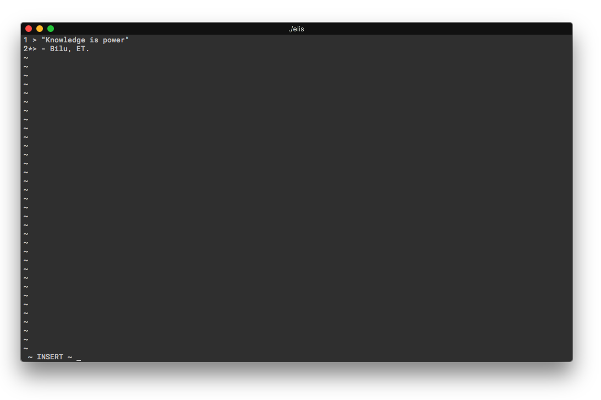

# ELIS
Simple Text Editor oriented by lines

ELIS is a simple text editor made with C++ using `ncurses` and double-linked lists.

This project aims to make use of the power from the double-linked list data
structure for the development of a simple text editor like Vi.



## Summary
+ [Dependencies](#dependencies)
+ [Installing](#installing)
+ [How to use](#how-to-use)
    + [Normal Mode](#normal-mode)
    + [Insert Mode](#insert-mode)
    + [Command Insert Mode](#command-insert-mode)
+ [Authors](#authors)

## Dependencies
+ `C++ 11`
+ `ncurses`
+ `make`
+ `less`

## Installing
In order to compile and get the program running, just clone the repo by doing:
```bash
git clone https://github.com/FelipeCRamos/ELIS.git && cd ELIS
```
And then, run the `make` command that will compile the entire project
(check [dependencies](#dependencies)).

Then, just run with `./elis [<file>]`.

## How to use
This implementation it's kind of exotic, so here's the tutorial:

There are three main modes on the Editor, which are:
+ [`NORMAL`](#normal-mode)
+ [`INSERT`](#insert-mode)
+ [`COMMAND INSERT`](#command-insert-mode)

### Normal Mode
This mode is the one to navigate around, perform undo operations and navigate
on the another modes. You can get here by pressing `ESC` key anywhere.

When on the `NORMAL` mode, you can:
+ Press `ENTER` or `j`: Go to the line below (if exists)
+ Press `k`: Go to the line above (if exists)
+ Press `u`: Undo what you have done
+ Press `i`: Enter on `INSERT` mode
+ Press `:`: Enter on `COMMAND INSERT` mode

### Insert Mode
This mode is the one to perfom type operations on your file. You can get here
by pressing the `i` key while on `NORMAL` mode.

When here, you can:
+ Press `ESC`: Go back to the `NORMAL` mode
+ Press `*` (any key): Insert character at the end of the current selected line

### Command Insert Mode
Here you can perfom read/write of files, go-to specific lines, append, insert,
remove lines... To get here you just need to type `:` while on `NORMAL` mode.

When on this mode, you can use the following commands:
+ `:W [<name>]`

    Saves all lines of the buffer in `name` ASCII file. If `name` isn't specified,
    simply saves on the actual file. If the actual filename wasn't provided,
    ELIS will ask for the `name` argument.

+ `:E <name>`

    Reads to the buffer all lines of an `name` ASCII file, If the specified file
    don't exist, an empty ASCII file `name` will be created.

+ `:I [n]`

    Enter in INSERT mode, being possible to insert text before Nth line. If `n`
    isn't provided, text will be inserted _before_ actual line.

+ `:A [n]`

    Enter in INSERT mode, being possible to insert text after Nth line. If `n` 
    isn't provided, text will be inserted ~after~ actual line.

+ `:M [n]`

    Makes Nth line the actual line. If `n` isn't provided, then the current line
    will be the last line on buffer.

+ `:D [n [m]]`

    Remove `n` to `m` lines. If only `n` is give, remove only that line. If no 
    numbers are given, removes the current line.

+ `:H`

    Provides a cool help text.

+ `:Q`

    Quits the program. If the actual text isn't saved, the program will show an 
    alert asking for save.


## Authors
This project was made by the following fellas:
+ [Daniel Guerra](https://github.com/Codigos-de-Guerra)
+ [Felipe Ramos](https://github.com/FelipeCRamos)
+ [Paulo Augusto](https://github.com/pauloamed)

And a special thanks to:
+ [Selan R. dos Santos](https://www.researchgate.net/profile/Selan_Santos)
